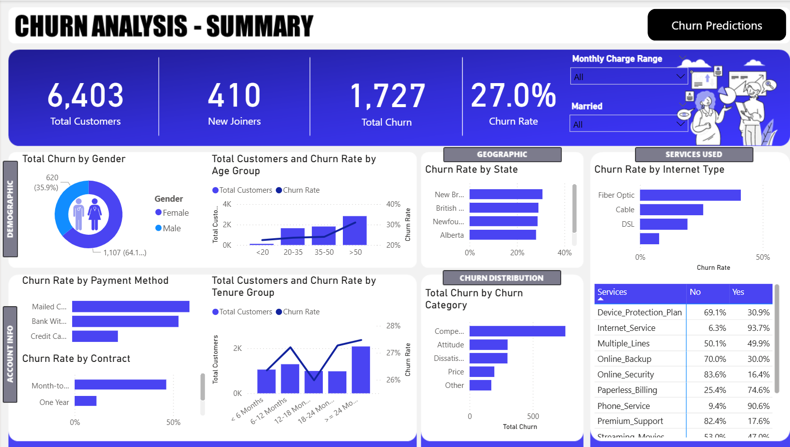
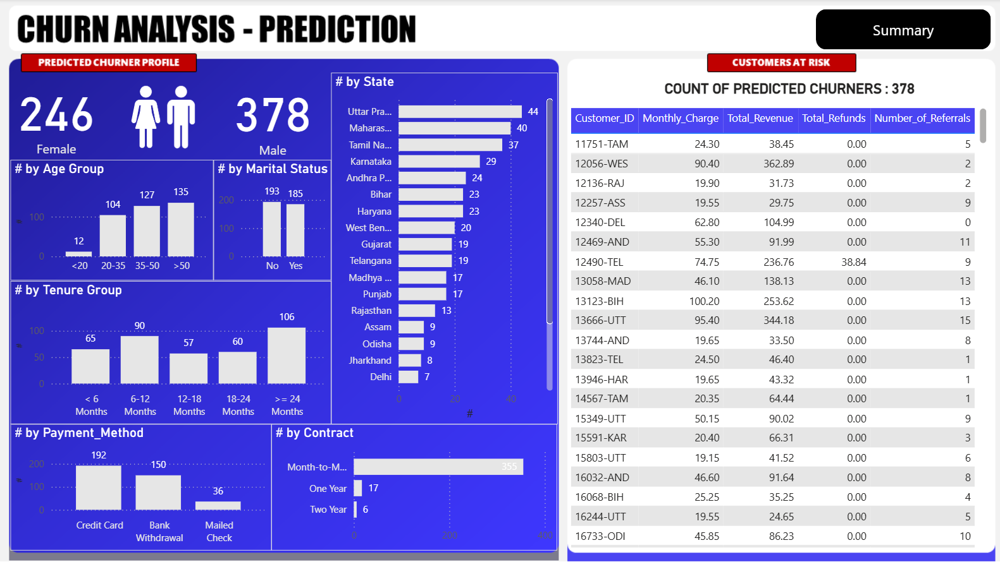

# Customer Churn Analysis Dashboard

This project is an end-to-end **Customer Churn Analysis** solution built using **Microsoft SQL Server**, **Power BI**, **Excel**, and **Python**. It combines ETL processes, data visualization, and machine learning to help identify churn patterns and support retention strategies.

## Tools & Technologies

- **Microsoft SQL Server (SSMS)** – Data storage, ETL, and cleaning
- **Power BI** – Dashboard development and data storytelling
- **Excel** – Source data handling and basic transformations
- **Python (Jupyter Notebook)** – Random Forest machine learning model
- **Pandas, Scikit-learn, Matplotlib** – Python libraries used

## Project Highlights

- Designed and implemented a **full-stack churn analysis workflow**, integrating SQL, Power BI, and Python.
- Performed **data cleaning and transformation** in SQL Server for structured analysis.
- Built **interactive dashboards** in Power BI and Excel to visualize KPIs such as churn rate, tenure, and customer segmentation.
- Developed a **Random Forest machine learning model** in Python to predict customer churn.
- Visualized **predicted churner profiles** in Power BI, enabling better targeting of at-risk customers.

## Sample Visualizations

### Churn Summary Dashboard  
*Overview of churn trends, KPIs, and retention insights.*

### Churn Prediction Page  
*Integrated machine learning predictions with customer demographics.*

## Project Structure
customer-churn-analysis/
├── README.md
├── PowerBI/
│   └── Churn_Analysis.pbix
├── Python_Model/
│   └── churn_prediction_model.txt
├── SQL/
│   └── churn_etl_queries.txt
├── Data/
│   └── Customers_Data.xlsx
|   └── Predictions_Data.xlsx
└── Images/
    └── summary_dashboard.png
    └── prediction_dashboard.png

